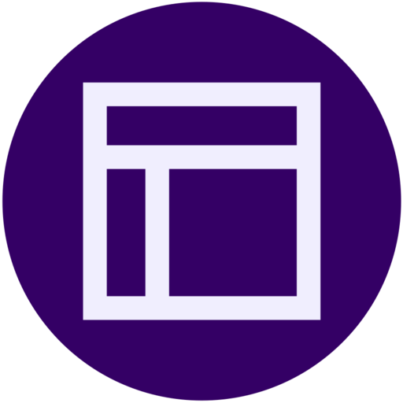

<a name="readme-top"></a>
<div align="center">
  
  <br/>

  <h3><b>DeskUp</b></h3>
  <p>A cross-platform desktop app to save and load your workspaces on demand.</p>
</div>

<!-- TABLE OF CONTENTS -->

# 📗 Table of Contents
- [📖 About the Project](#about-project)
  - [🛠 Built With](#built-with)
    - [Tech Stack](#tech-stack)
    - [Development & Tooling](#development-tooling)
    - [Key Features](#key-features)
- [💻 Getting Started](#getting-started)
  - [Windows](#windows)
  - [Linux](#linux)
- [🔭 Roadmap & Future Features](#future-features)
- [❓ FAQ](#faq)
- [⭐️ Support This Project](#support)

---

# 📖 DeskUp <a name="about-project"></a>

**DeskUp** is a lightweight, cross-platform desktop application that lets you save and load your workspaces instantly.  
Whether you work with multiple terminals, editors, or applications, DeskUp helps you quickly restore your setup and keep your workflow organized.  

---

## 🛠 Built With <a name="built-with"></a>

### Tech Stack <a name="tech-stack"></a>
- **Language & GUI:** [C++17](https://isocpp.org/), [wxWidgets](https://www.wxwidgets.org/)  

### Development & Tooling <a name="development-tooling"></a>
- **Build System:** [CMake](https://cmake.org/), [CTest](https://cmake.org/cmake/help/latest/manual/ctest.1.html), [CPack](https://cmake.org/cmake/help/latest/module/CPack.html)  
- **Packaging & Distribution:** [AppImage](https://appimage.org/) + [linuxdeploy](https://github.com/linuxdeploy/linuxdeploy)  
- **CI/CD:** [GitHub Actions](https://github.com/features/actions)  
- **Documentation:** [Doxygen](https://www.doxygen.nl/)  

### Key Features <a name="key-features"></a>

> Coming soon!!

<p align="right">(<a href="#readme-top">back to top</a>)</p>

---

## 💻 Getting Started <a name="getting-started"></a>

Follow the instructions below to run **DeskUp** locally depending on your operating system.  

---

### 🪟 Windows <a name="windows"></a>

#### Prerequisites
- Windows 10 or newer (x86_64)

#### Setup
1. Go to [releases](https://www.github.com/NicolasSerranoGarcia/DeskUp/releases)  
2. Download the latest `.zip` package  
3. Extract it and run the `.exe` inside  

<p align="right">(<a href="#readme-top">back to top</a>)</p>

---

### 🐧 Linux <a name="linux"></a>

#### Prerequisites
- x86_64 architecture  
- Tested on: Ubuntu 20.04+, Debian 11+, Fedora 36+, Arch Linux  
- Should work on most distributions released after ~2018  

#### Setup
1. Go to [releases](https://www.github.com/NicolasSerranoGarcia/DeskUp/releases)  
2. Download the latest `.AppImage`  

#### Make it executable

```bash
chmod +x DeskUp-vX.Y.Z-x86_64.AppImage
```

#### Run

```bash
./DeskUp-vX.Y.Z-x86_64.AppImage
```

<p align="right">(<a href="#readme-top">back to top</a>)</p>

### 🔭 Future Features <a name="future-features"></a>

> Coming soon!!

<p align="right">(<a href="#readme-top">back to top</a>)</p>

⭐️ Support This Project <a name="support"></a>

If you like this project and want to support its development, you can:

⭐️ Star this repository on GitHub

🐛 Report bugs or request features via [issues](https://github.com/NicolasSerranoGarcia/DeskUp/issues)

🤝 Contribute with pull requests

Support my other [socials](linktr.ee/NicolasSerrano) ;\) 

<p align="right">(<a href="#readme-top">back to top</a>)</p>